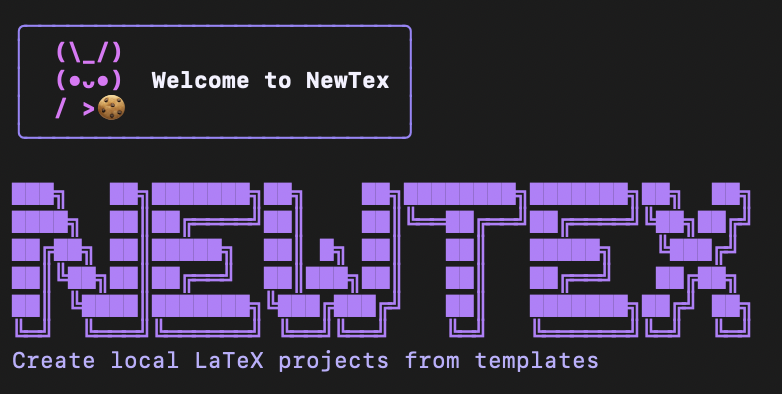

<h1 align="center">NewTex-CLI</h1>

<p align="center">
	
</p>

## 1. Installation

```bash
pipx install newtex-cli
```

Common `pip` install alternative:

```bash
python -m pip install newtex-cli
```

Works on macOS, Linux, and Windows (with Python/pipx).

## 2. Configuration

Bundled templates are discovered dynamically from `src/newtex/resources/templates`.

### 2.1 Global template config (recommended)

Configure templates once and use `newtex` from anywhere:

```bash
newtex --template-set acm-conf=/absolute/path/or/url/to/template
newtex --default-template-set acm-conf
newtex --templates-list
```

This writes to `~/.config/newtex/templates.yml`.

## 3. CLI commands

### 3.1 Command reference

| Command | Description |
| --- | --- |
| `newtex --help` | Show CLI help |
| `newtex --version` | Show current installed version |
| `newtex --update` | Update to the latest published version |
| `newtex --upgrade` | Alias of `--update` |
| `newtex --template-set <alias>=<path-or-url>` | Add or update a global template alias |
| `newtex --template-set <alias>=<path-or-url> --template-description "..."` | Add alias with description |
| `newtex --default-template-set <alias>` | Set the global default template alias |
| `newtex --set-default-template <alias>` | Backward-compatible alias for `--default-template-set` |
| `newtex --templates-list` | Show configured global templates |
| `newtex` | Start interactive project creation |
| `newtex <project-name> <template>` | Create a project in non-interactive mode |
| `newtex <project-name> <template> --no-git` | Skip `git init` |
| `newtex <project-name> <template> --track-pdf` | Keep compiled PDFs tracked |
| `newtex <project-name> <template> --no-vscode` | Exclude shared `.vscode/` settings |
| `newtex <project-name> <template> --open` | Open generated project in VS Code |

### 3.2 Quick examples

```bash
newtex --help
newtex --version
newtex --update
newtex --upgrade
newtex
newtex exlang-paper acm-conf
newtex exlang-paper acm-conf --no-git
newtex exlang-paper acm-conf --track-pdf
newtex exlang-paper acm-conf --no-vscode
newtex exlang-paper acm-conf --open
```

Interactive flow now shows a scaffold plan summary before generation and asks for confirmation.

## 4. Notes

- Project names must be lowercase kebab-case (example: `exlang-paper`).
- If a template path is invalid, the CLI exits with an error message.
- Template sources support three modes:
	- local directory path (copied as-is)
	- `package://<name>` (copied from bundled package resources)
	- remote template URL (scaffolded via Copier)

## 5. Install on another machine

```bash
pipx install newtex-cli
# or
python -m pip install newtex-cli
```

Then configure templates on that machine:

```bash
newtex --template-set acm-conf=/absolute/path/or/url/to/template
newtex --default-template-set acm-conf
```
